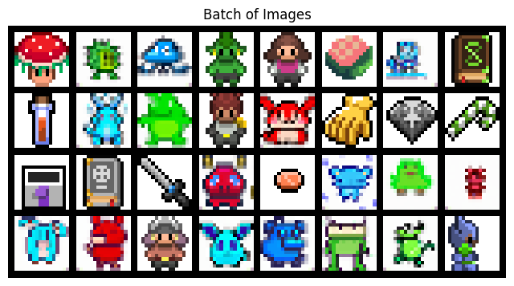
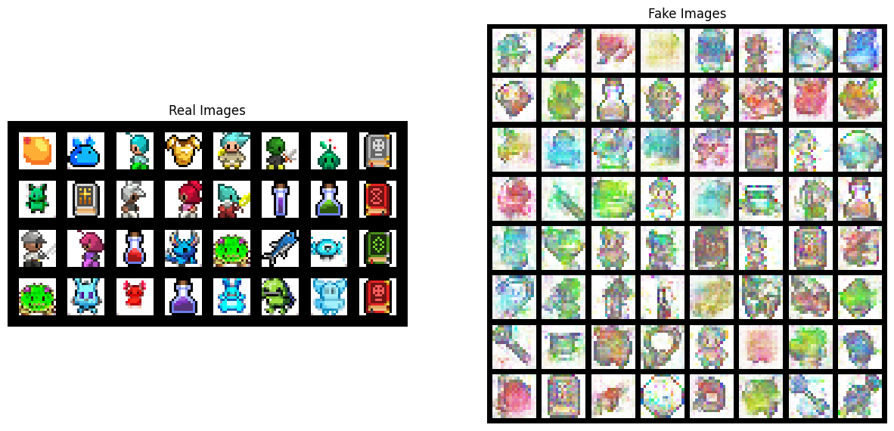
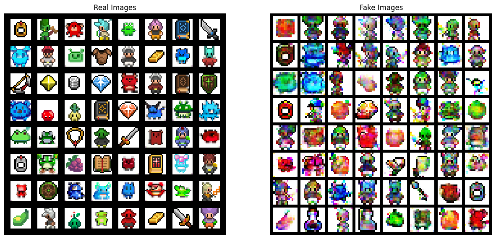

Dataset link: https://www.kaggle.com/datasets/ebrahimelgazar/pixel-art/data

### Sample: 


### DCGAN v1.0 Output:


### DC + Conditional GAN


### Comparison : Different parameter(LG, LD, num_epoch)

### Installation
```bash
pip install requirement.txt
```
#### WINDOW ONLY
```bash
python -m pip install torch torchvision --extra-index-url https://download.pytorch.org/whl/cu128 --force-reinstall --no-cache-dir
```
#### MAC ONLY
```bash
MAC ONLY:pip install torch torchvision
```


#### Download PyTorch CUDA version to train on GPU
https://pytorch.org/get-started/locally/

