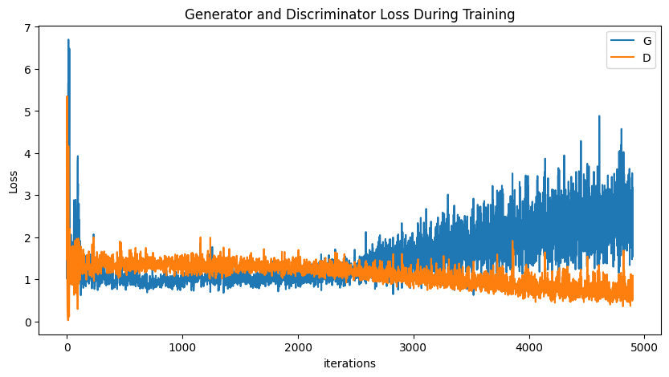
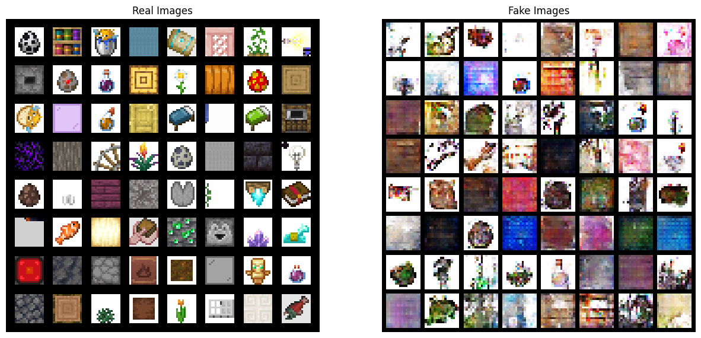
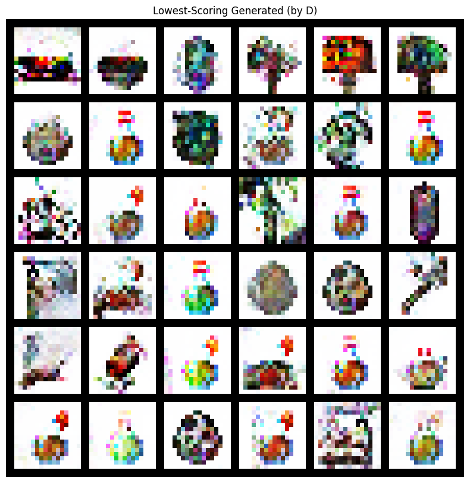

# THE MINECRAFT DATASET DCGAN MODEL
Dataset link: https://huggingface.co/datasets/James-A/Minecraft-16x-Dataset

```python
EPOCH = 100
BATCH_SIZE = 64
ngf, ndf = 32
lrD = 5e-3
lrG = 7e-3

filter_types = [
    'Utility',
    'Decorative',
    'Wood',
    'Plant',
    'Stone',
    'Potion',
    'Food',
    'Tool',
    'Spawn Egg',
    'Light Source'
]

# Utilized data augmentation
num_augmentation = 3
```
everything else is the same as dcgan

## LOSS PLOT


## OUTPUT


## EVALUATION
### BEST SPRITES GENERATED


### WORST SPRITES GENERATED

