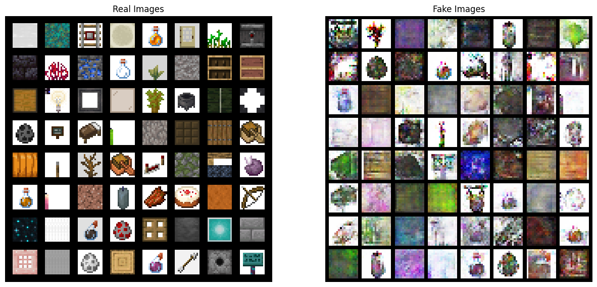
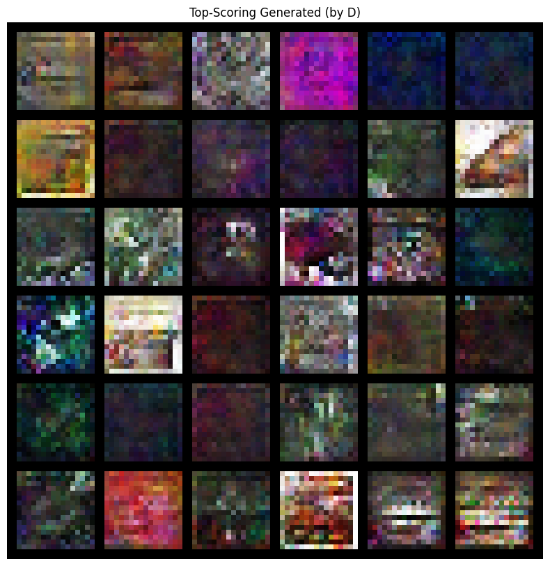
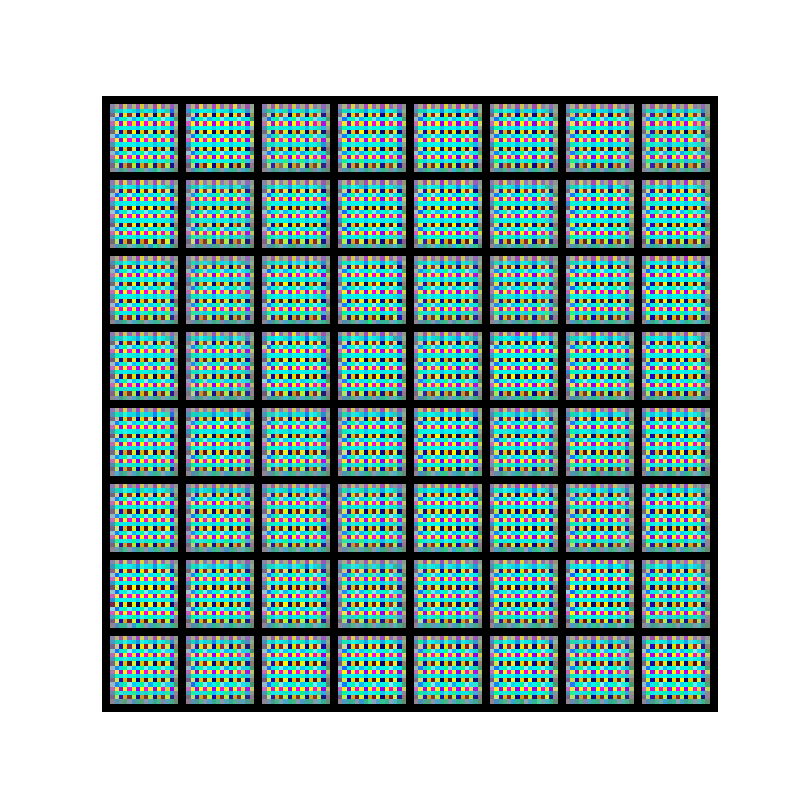
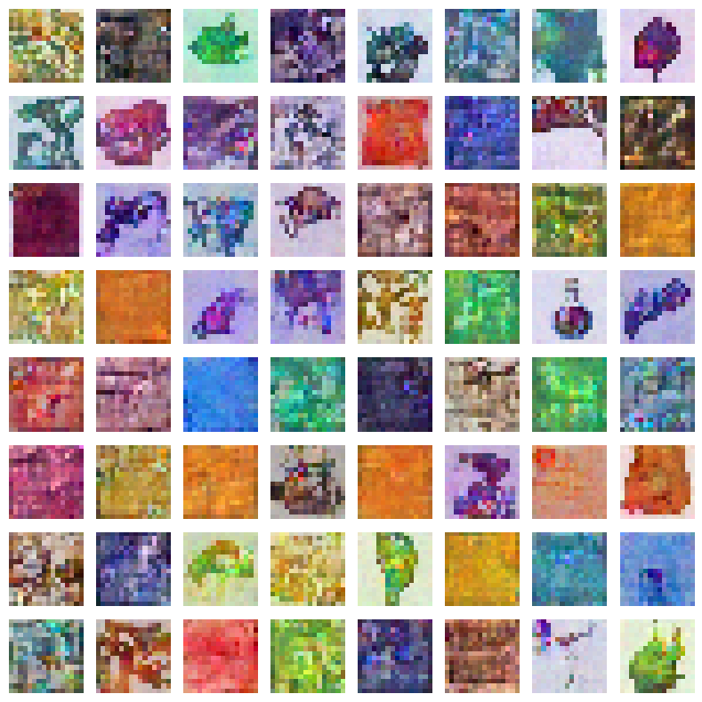
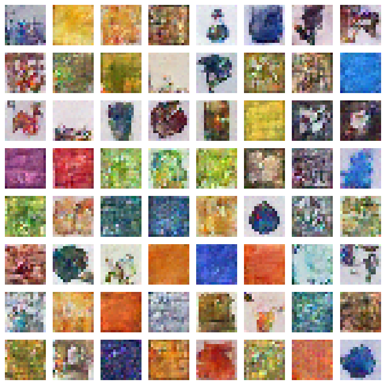

# THE MINECRAFT DATASET
Dataset link: https://huggingface.co/datasets/James-A/Minecraft-16x-Dataset

##  DCGAN model Baseline
```python
EPOCH = 100
BATCH_SIZE = 64
ngf, ndf = 32
# Learning rate for optimizers
lrD = 0.0001
lrG = 0.0002

filter_types = [
    'Utility',
    'Decorative',
    'Wood',
    'Plant',
    'Stone',
    'Potion',
    'Food',
    'Tool',
    'Spawn Egg',
    'Light Source'
]
num_augmentation = 3

# everything else is the same as dcgan
```

### Loss Plot


### Output


### Evaluation of Generated Sprites

| Category | Preview |
|----------|---------|
| **Best Sprites Generated** |  |
| **Worst Sprites Generated** |  |

### GIF



## DCGAN model Optimal Config (Lukman's config except epoch incresed 15 -> 100)
```python
# Number of workers for dataloader
workers = 2

# Batch size during training
batch_size = 128

# Number of channels in the training images. For color images this is 3
nc = 3

# Size of z latent vector (i.e. size of generator input)
z_dim = 32

# Number of training epochs
num_epochs = 100 # Increased due to high variance data and limited

# Number of GPUs available. Use 0 for CPU mode.
ngpu = 1

# Size of feature maps in generator
ngf = 32

# Size of feature maps in discriminator
ndf = 32

# Learning rate for optimizers
lrD = 0.0001
lrG = 0.0004

# Beta1 hyperparameter for Adam optimizers
beta1 = 0.5
beta2 = 0.999
```

### dcgan_optimal_config Output


## DDPM model

### ddpm_version_1 (Using Raqib's original config)
```python
# hyperparameters

# diffusion hyperparameters
timesteps = 500
beta1 = 1e-4
beta2 = 0.02

# network hyperparameters
device = torch.device("cuda:0" if torch.cuda.is_available() else torch.device('cpu'))
n_feat = 64 # 64 hidden dimension feature
n_cfeat = 10 # context vector is of size 5
height = 16 # 16x16 image
save_dir = '/kaggle/working/'

# training hyperparameters
batch_size = 100
n_epoch = 50
lrate=1e-3
num_augmentations = 7 # 7259 images in total
```



### ddpm_version_2 (Reduced batch size and learning rate)
```python
# hyperparameters

# diffusion hyperparameters
timesteps = 500
beta1 = 1e-4
beta2 = 0.02

# network hyperparameters
device = torch.device("cuda:0" if torch.cuda.is_available() else torch.device('cpu'))
n_feat = 64 # 64 hidden dimension feature
n_cfeat = 10 # context vector is of size 5
height = 16 # 16x16 image
save_dir = '/kaggle/working/'

# training hyperparameters
batch_size = 32
n_epoch = 50
lrate=1e-4
num_augmentations = 7 # 7259 images in total
```
